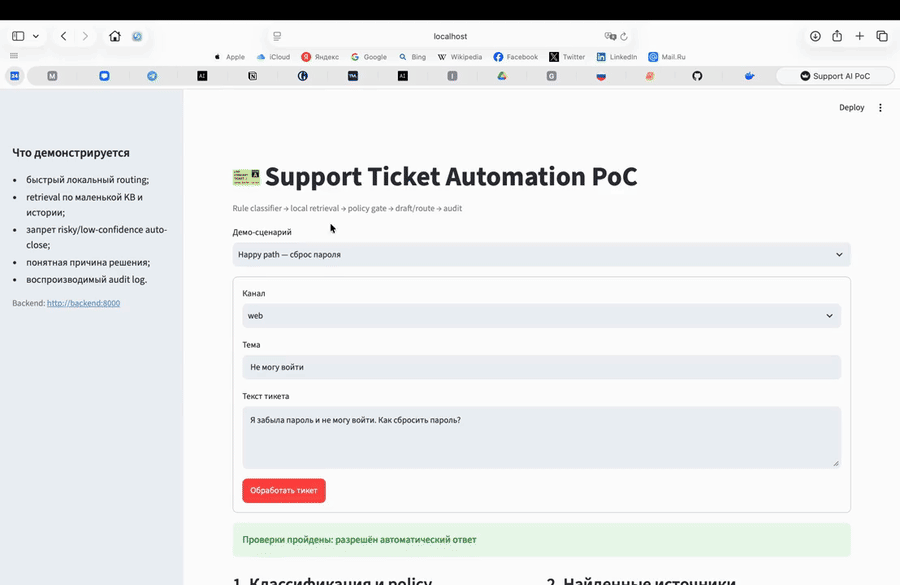

# Автоматизация обработки тикетов поддержки


Решение принимает тикет из канала поддержки, определяет тему и уровень риска,
находит релевантную статью базы знаний или похожий исторический тикет и выбирает
действие: подготовить ответ либо передать обращение оператору. В целевой системе
классификация работает на быстром пути до 500 мс, а retrieval и генерация ответа
выполняются асинхронно.

## Зачем это бизнесу

Сейчас 200 тысяч тикетов в день при стоимости 150 ₽ за ручную обработку дают до
30 млн ₽ операционных затрат в день. Автоматизация части из 40% типовых
обращений высвобождает время операторов для сложных случаев и помогает отвечать
в пределах SLA 15 минут во время всплесков. Для пользователя ценность — более
быстрый и единообразный ответ, а для бизнеса — меньший backlog и стоимость
обработки. Автоматизация расширяется только при сохранении CSAT не ниже 4,2 и
отсутствии роста текущего reopen rate 9%.

## Демонстрация



PoC показывает два обязательных end-to-end сценария и один дополнительный:

| Сценарий | Вход | Результат |
|---|---|---|
| Happy path | «Забыла пароль и не могу войти» | `password_reset` → найдена KB → `auto_reply` |
| Risky path | «С карты дважды списали деньги» | `charge_dispute` → `payments_l2` → `human_review`, без draft |
| Low confidence | неизвестная формулировка | `unknown` → `manual_triage` → `human_review` |

Каждое решение получает `audit_id`. В audit log сохраняются версии компонентов,
scores, найденные документы, маршрут и действие, но не исходный текст тикета.

## Запуск PoC

Требования: Docker с поддержкой Compose.

```bash
docker compose up --build
```

После запуска:

- Streamlit UI: <http://localhost:8501>;
- Swagger API: <http://localhost:8000/docs>;
- backend healthcheck: <http://localhost:8000/health>.

Для демонстрации откройте UI, последовательно выберите `Happy path` и
`Risky path` и сравните `action`, маршрут, найденные источники и наличие draft.
Запись аудита внутри контейнера можно проверить командой:

```bash
docker compose exec backend tail -n 1 /app/runtime/audit.jsonl
```

## Smoke tests

```bash
docker compose run --rm backend pytest -q
```

Три теста проверяют happy path, risky path и low-confidence fallback. Ключевая
safety-гарантия зафиксирована явно: risky и low-confidence тикеты никогда не
получают `auto_reply`. Остановить запущенное демо: `docker compose down`.

## Что реализовано, а что осталось дизайном

| Реально работает в PoC | Описано как целевая архитектура |
|---|---|
| FastAPI endpoint и Streamlit UI | адаптеры chat/email/web/mobile и support platform |
| rule-based intent/risk classifier | fine-tuned encoder с calibrated confidence |
| локальный TF-IDF retrieval по 7 JSON-документам | BM25 + dense embeddings + vector DB + reranker |
| ответ из утверждённого шаблона KB | RAG → локальная GLM → разрешённый внешний LLM fallback |
| policy gate для `auto_reply`/`human_review` | отдельный safety service, DLP и policy registry |
| append-only JSONL audit | защищённое audit storage с RBAC и retention |
| синхронный процесс в одном приложении | hot path, event bus и асинхронные workers |

PoC доказывает связность архитектурной идеи, а не качество production-модели или
работу под нагрузкой 200 тысяч тикетов в день.

## Допущения и ограничения PoC

- Поддерживаются русский текст и четыре демонстрационных intent; вложения и OCR
  не реализованы.
- Confidence и safety thresholds заданы вручную, потому что размеченного
  production-датасета нет.
- Мини-база знаний считается проверенной и актуальной; исторические тикеты
  используются как дополнительный evidence, но не как источник текста ответа.
- Настоящая GLM и внешний LLM API не вызываются: их роль заменяет
  детерминированный шаблон, чтобы результат можно было воспроизвести.
- В PoC нет event bus, autoscaling, production DLP и защищённого хранилища
  аудита; эти части показаны только в целевом дизайне.

## Документация

| Файл | Содержание |
|---|---|
| [docs/architecture.md](docs/architecture.md) | компоненты, поток данных, hot/async paths, хранилища и fallback |
| [docs/ml.md](docs/ml.md) | rules/ML/embeddings/RAG/LLM, данные, разметка и валидация |
| [docs/monitoring.md](docs/monitoring.md) | технические, ML, продуктовые и cost-метрики |
| [docs/risks-and-ops.md](docs/risks-and-ops.md) | highload, privacy, safety и human-in-the-loop |
| [AI_USAGE.md](AI_USAGE.md) | как использовался AI и какие его ошибки были исправлены |
| [SELF_REVIEW.md](SELF_REVIEW.md) | слабые места, нерешённые риски и критерии остановки пилота |

<details>
<summary>Если Docker build падает с CERTIFICATE_VERIFY_FAILED</summary>

Dockerfile уже ограниченно доверяет официальным хостам PyPI. Пересоберите образ
без старого слоя:

```bash
docker compose build --no-cache
docker compose up
```

`trusted-host` — компромисс только для локального PoC. В production нужно
добавить корпоративный root CA в trust store образа.

</details>
