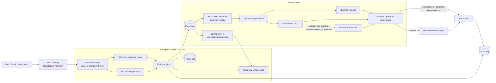

# Целевая архитектура

## 1. Что проектируем

Система принимает обращения из чата, email, веб-формы и мобильного приложения,
быстро определяет очередь и риск, а затем либо готовит ответ оператору, либо
автоматически отвечает в безопасных типовых случаях.

Ключевое разделение:

- **быстрый синхронный путь** — правила и классификатор, p95 не более 500 мс;
- **медленный асинхронный путь** — поиск похожих тикетов, RAG и генерация ответа.

### Нагрузка и допущения

| Показатель | Расчёт |
|---|---:|
| Средний поток | 200 000 / 86 400 = **2,3 тикета/с** |
| Максимальный наблюдаемый пик | 20 000 / 600 = **33,3 тикета/с** |
| Проектная ёмкость входа | **100 тикетов/с** (запас ×3 к пику) |
| Типовые обращения | 200 000 × 40% = **80 000/день** |

Вложения не обрабатываются на быстром пути. Сначала сохраняются текст и ссылка
на вложение, OCR/антивирусная проверка выполняются позже.

## 2. Общая схема

## 3. Последовательность обработки

1. **Приём.** Адаптер канала приводит обращение к единому формату. По
   `channel + external_ticket_id` повторный запрос не создаёт дубликат.
2. **Быстрая маршрутизация.** Локально выполняются очистка, PII-разметка,
   жёсткие правила и ML-классификация: тема, очередь, приоритет, риск и
   confidence. Результат сохраняется, тикет сразу виден оператору.
3. **Асинхронное обогащение.** Событие из event bus запускает OCR вложений,
   поиск дубликатов и кластеризацию массовых инцидентов.
4. **Поиск ответа.** Сначала проверяются утверждённый incident-template и cache.
   Затем RAG ищет актуальную статью базы знаний и похожие успешно решённые
   тикеты. История помогает выбрать маршрут, но не считается достоверной
   инструкцией без подтверждения базой знаний.
5. **Генерация.** Локальная предобученная GLM получает только очищенный тикет и
   найденные документы. Внешний LLM — последний fallback при технической ошибке
   или плохом ответе GLM, только если нет PII и не превышен бюджет.
6. **Решение.** Policy engine разрешает автоответ только для allowlist-категорий
   с высокой уверенностью. В остальных случаях оператор видит черновик,
   источники и причину маршрута.
7. **Обратная связь.** Исправление, принятие/отклонение ответа, итоговая очередь,
   CSAT и повторное открытие записываются для оценки и будущего обучения.

## 4. Основные компоненты

| Компонент | Назначение |
|---|---|
| Channel adapters + API Gateway | единый контракт, аутентификация, rate limit, idempotency |
| Preprocessor | очистка email-цитат, язык, локальное обнаружение/маскирование PII |
| Router | быстрые правила + ML-классификатор |
| Policy engine | пороги, запрет автодействий, приоритеты SLA; правила версионируются |
| Event bus | буфер пиков, повторная обработка; доставка at-least-once |
| Incident detector | объединение похожих тикетов и обнаружение всплеска темы |
| RAG | hybrid search (keyword + embeddings), фильтры доступа, reranking |
| LLM gateway | local GLM, внешний fallback, timeout, circuit breaker, token budget |
| Safety service | проверка PII, ссылок, groundedness и prompt injection |
| Agent workspace | маршрут, черновик, источники, confidence и кнопки feedback |
| Support platform | создаёт очередь/тикет и отправляет ответ обратно в нужный канал |
| Business APIs | read-only статус сервиса, заказа или платежа через разрешённые методы; LLM не вызывает их напрямую |

## 5. Хранилища

| Хранилище | Что хранится |
|---|---|
| Реляционная БД | тикет, статус, маршрут, версия события, действия оператора |
| Event bus | события обработки; позволяет пережить краткий пик без потери тикетов |
| Object storage | вложения, версии датасетов/моделей, длительный audit trail |
| Search + vector index | статьи базы знаний и обезличенные исторические тикеты |
| Model/prompt registry | версия модели, prompt, thresholds и результаты проверки |

Исходный текст с PII хранится в ограниченной зоне. В embeddings, обычные логи и
внешний LLM он не попадает. Audit содержит входной hash/ссылку, версии модели,
правил и документов, scores, итоговый ответ и действие человека.

## 6. Запасные пути

- Классификатор не уверен — тикет попадает в общую triage-очередь; локальная GLM
  может предложить повторный маршрут асинхронно, но не задерживает приём.
- RAG не нашёл свежий источник — генерации нет, оператор получает тикет без
  черновика.
- Локальная GLM недоступна — шаблон/cache, затем разрешённый внешний fallback,
  иначе ручная обработка.
- Внешний LLM недоступен или исчерпан бюджет — circuit breaker отключает вызовы;
  быстрая маршрутизация продолжает работать.
- При массовом инциденте подтверждённый оператором единый шаблон заменяет тысячи
  индивидуальных генераций.
